# sureau_ecos_py

<!-- WARNING: THIS FILE WAS AUTOGENERATED! DO NOT EDIT! -->

This file will become your README and also the index of your
documentation.

## Install

``` sh
pip install sureau_ecos_py
```

## How to use

Fill me in please! Don’t forget code examples:

``` python
1 + 1
```--

```mermaid
    graph TD;

        create_modeling_options-->create_climate_data;
        create_simulation_parameters-->create_climate_data;



        %%run.write.configs-->output_1[updated settings with ensemble IDs for SA and ensemble analysis ];
        %%run.write.configs-->posterior.files[post.distns.Rdata or prior.distns.Rdata];
        %%output_1[updated settings with ensemble IDs for SA and ensemble analysis]-->get.ensemble.samples;

        %%posterior.files[post.distns.Rdata or prior.distns.Rdata]-->get_parameter_samples;

        %%input_get_ensemble_1[pft.samples]-->get.ensemble.samples;
        %%input_get_ensemble_2[env.samples]-->get.ensemble.samples;
        %%input_get_ensemble_3[ensemble.size]-->get.ensemble.samples;
        %%input_get_ensemble_4[param.names]-->get.ensemble.samples;

        %%get_parameter_samples-->input_get_ensemble_1[pft.samples];
        %%get_parameter_samples-->input_get_ensemble_2[env.samples];
        %%get_parameter_samples-->input_get_ensemble_3[ensemble.size];
        %%get_parameter_samples-->input_get_ensemble_4[param.names];

        %%get.ensemble.samples-->output_get_ensemble[ensemble.samples, matrix of random samples from trait distributions];

        %%output_get_ensemble[ensemble.samples, matrix of random samples from trait distributions]-->write.ensemble.configs;
        %%model-->write.ensemble.configs;
        %%simple_biocro.xml-->write.ensemble.configs;

        %%write.ensemble.configs-->output_write_ensemble_1[$runs = data frame of runids];
        %%write.ensemble.configs-->output_write_ensemble_2[$ensemble.id = the ensemble ID for these runs];
        %%write.ensemble.configs-->output_write_ensemble_3[$samples with ids and samples used for each tag.];
        %%write.ensemble.configs-->output_write_ensemble_4[sensitivity analysis configuration files as a side effect];

        %% Blue color boxes ------------------------------------------------------------------

        style create_climate_data fill:#00758f
        style create_modeling_options fill:#00758f

        %% Red color boxes ------------------------------------------------------------------------

        style write.ensemble.configs fill:#880808

```


